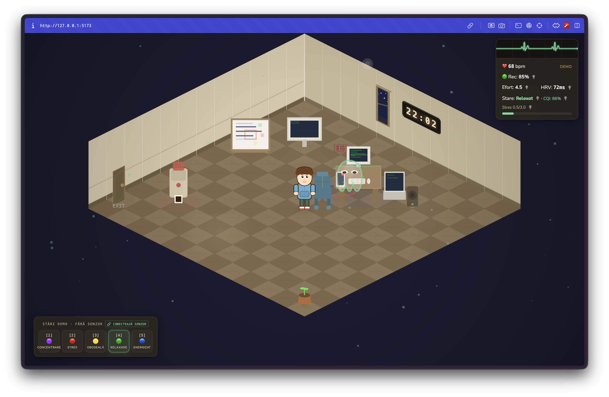
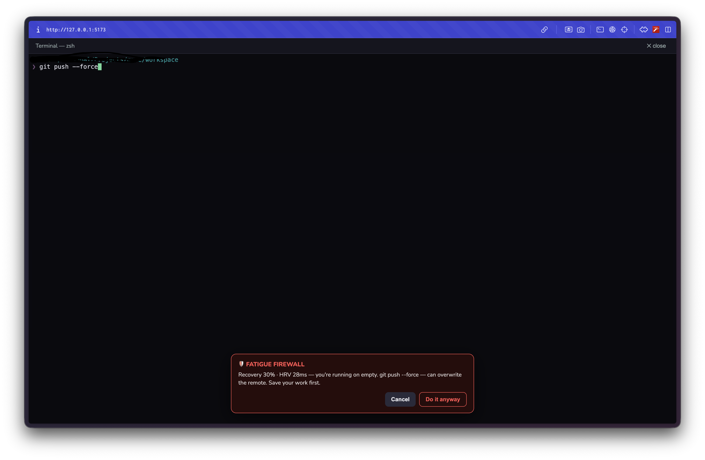
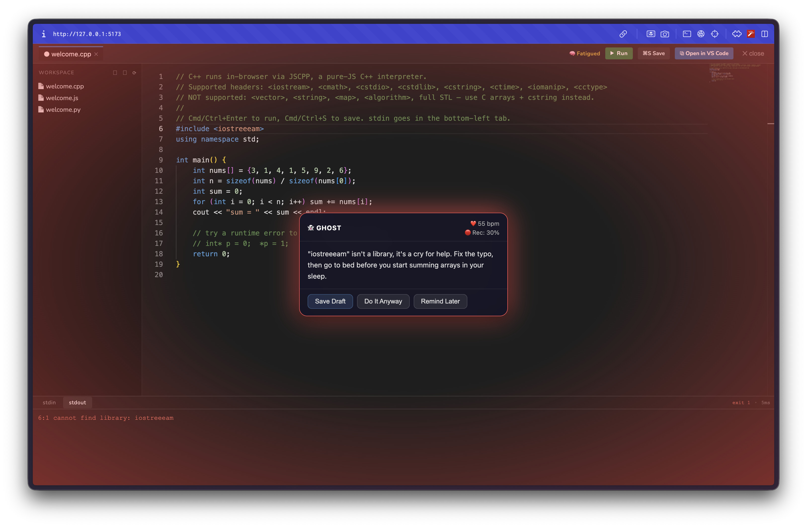
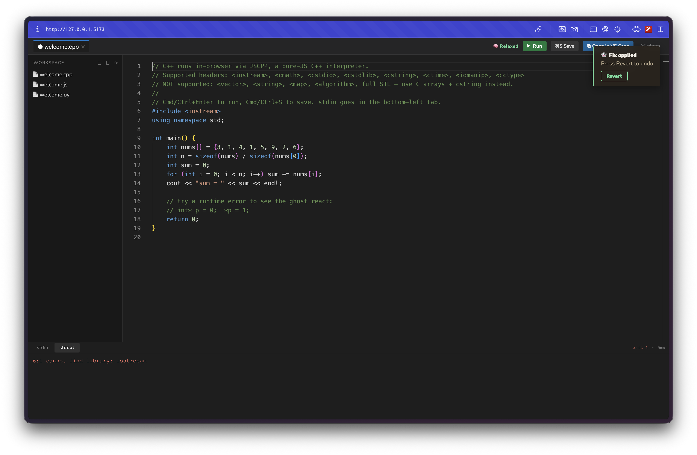

# DevLife

[](https://github.com/amarieidavid26-byte/devlife/actions/workflows/ci.yml)



developerii obositi iau decizii proaste in cod, si niciun tool nu se uita la corpul lor cand se intampla asta. DevLife e un companion AI conectat la tine prin WHOOP si Web Bluetooth: iti citeste pulsul, HRV-ul si recovery-ul, clasifica starea ta cognitiva si reactioneaza. in deep focus te lasa in pace; cand esti epuizat la 2 dimineata, Fatigue Firewall iti blocheaza `git push --force` inainte sa apuci sa regreti.

construit pentru developeri solo si freelanceri care lucreaza noaptea, SRE on-call, studenti si quantified-self enthusiasts cu wearables. analiza publicului tinta si a competitorilor: `docs/positioning.md`.

## quick start

```bash
git clone https://github.com/amarieidavid26-byte/devlife.git
cd devlife
./scripts/setup.sh    # venv + deps
./scripts/dev.sh      # backend + frontend, app pe http://127.0.0.1:5173
```

setup complet (.env, Pyodide, conectare WHOOP): `docs/install-runbook.md`.

## cum functioneaza

biometrice (WHOOP + BLE + tastare) → clasificare stare cognitiva → ghost AI reactioneaza → interventii + firewall

cinci stari: RELAXED · DEEP_FOCUS · STRESSED · FATIGUED · WIRED. ghost-ul reactioneaza diferit in fiecare; in FATIGUED blocheaza activ `git push --force`, `rm -rf`, `DROP TABLE`, `chmod 777` si restul pattern-urilor riscante.

## ce il face diferit

**fatigue firewall cu defense in depth.** e 2 noaptea, recovery 30%, starea: FATIGUED. tastezi `git push --force` in terminalul din joc si apesi Enter. comanda nu ajunge niciodata la shell: interceptarea din UI e doar primul strat, iar serverul mirroreaza tastele in PTY (`KeystrokeFirewall`) si inghite Enter-ul cand comanda e riscanta, deci nu treci nici daca ocolesti browserul. exista buton "Do it anyway", valabil pentru o singura comanda si auditat in SQLite: decizia devine una constienta, nu reflexul unui om epuizat.



**HRV live (RMSSD).** cand strapul transmite intervalele RR prin BLE, calculam RMSSD pe fereastra glisanta de 60s, cu filtrare de artefacte. WHOOP iti arata HRV-ul de ieri; noi il masuram in mijlocul sesiunii de cod.

**dinamica tastarii, fara niciun wearable.** stres si oboseala estimate din ritmul tastarii (intervale intre taste, variabilitatea lor, rata de backspace, pauzele de gandire) fata de baseline-ul tau personal, persistat in SQLite. se trimit doar intervale si categorii, niciodata ce tastezi. fuziunea semnalelor: puls real > tastare > sumar WHOOP > mock.

**iese din joc, in editorul tau real.** extensia VS Code (DevLife Bridge) vorbeste cu acelasi backend, dar cu contextul real din editor: ghost-ul analizeaza codul la care chiar lucrezi, interventiile apar ca notificari VS Code, iar starea cognitiva sta in status bar (`vscode-extension/README.md`).

## restul, pe scurt

- IDE real in joc: Monaco pe fisiere reale de pe PC, file tree, taburi, Cmd/Ctrl+S (`docs/local-ide.md`)
- terminal real via xterm.js + PTY, cu shell-ul tau (implicit zsh); ruleaza orice, inclusiv TUI-uri (vim, htop)
- completari AI inline in stil Cursor (Claude Haiku, ghost-text, Tab), adaptate starii cognitive
- LSP real: diagnostice, autocomplete si hover prin pyright / typescript-language-server
- "Open in full VS Code": code-server pe acelasi workspace, in iframe, doar local
- desk code runner: Python (Pyodide), JavaScript (Web Worker) si C/C++ (JSCPP) in sandbox; erorile de runtime merg la ghost (`docs/desk-code-runner.md`)
- apply fix: ghost propune patch-uri cu preview, confirm si rollback
- session replay in SQLite + raport HTML exportabil, self-contained, RO/EN (`GET /api/session/report/html`)
- panou "De ce aceasta stare?" in dashboard: semnalul dominant si factorii care au decis clasificarea; starea o decide clasificatorul local, nu ghost-ul AI
- chei API din UI (BYOK): Claude + WHOOP direct din dashboard, salvate doar in SQLite local, mascate in API
- demo offline: fara backend, biometricele sunt simulate client-side; starile 1-5, HUD-ul, ghost-ul si ECG-ul merg complet
- sleep mode, personalitati de ghost (antrenor strict / prieten cald / sarcastic, din Settings), i18n RO/EN cu 603 chei

<p align="center">
  
  
</p>

## arhitectura

```
Browser (PixiJS)  <──ws://──>  FastAPI (Python)  <──>  Claude API
                                     │
                               SQLite (sessions,
                               interventions, audit)
                                     │
                              WHOOP API / BLE mock
```

frontend vanilla JS + PixiJS 7 (camera izometrica procedurala, zero sprite-uri), Monaco + xterm.js, backend FastAPI + WebSockets, persistenta SQLite (WAL), Claude API (Sonnet pentru ghost, Haiku pentru inline). fiecare layer, cu locatia exacta in cod: `docs/architecture.md`.

## de ce aceste tehnologii

| alegere | alternativa respinsa | motivul |
|---------|---------------------|---------|
| FastAPI | Flask / Django | WebSocket nativ + Pydantic integrat (validarea e parte din contractul Apply Fix); async fara plugin-uri |
| PixiJS 7 | Three.js / Phaser | 2D WebGL pur, control complet pe randarea izometrica procedurala; Three.js e overkill 3D, Phaser impune un game-loop opinionat |
| vanilla JS | React / Vue | UI-ul de joc e canvas, nu DOM; un framework ar adauga un layer de reconciliere peste PixiJS fara castig |
| SQLite (WAL) | Postgres | zero deployment overhead, ACID, reads concurente; volumul unei sesiuni de cod nu justifica un server de DB |
| Claude API | GPT / local LLM | JSON structurat stabil pentru contractul de analiza + calitate pe cod; Haiku tine completarile inline sub ~1s |
| WHOOP + Web Bluetooth | doar API polling | API-ul da sumarul zilnic; BLE da pulsul + intervalele RR in timp real, din care calculam noi insine HRV-ul live |
| Pyodide + Web Worker | executie pe server | codul utilizatorului ruleaza sandboxed in browser, zero risc pe server; workerul se termina fortat la timeout |
| pty (stdlib) | node-pty / xterm server | zero dependinte native; add_reader pe master fd = streaming fara thread busy |

## teste

```bash
./scripts/run-tests.sh    # 242 teste + junit.xml + coverage HTML in evidence/tests/
```

acoperirea pe module si arii (clasificator, HRV live, firewall PTY, apply fix, security jail, WS end-to-end): `evidence/tests/SUMMARY.md`.

## securitate

backend-ul asculta doar pe `127.0.0.1`; fiecare endpoint privilegiat cere token de sesiune si verifica Origin, iar operatiile de fisiere ale editorului sunt blocate in afara `WORKSPACE_ROOT`. terminalul e altceva: un shell real, deliberat nerestrictionat (asta e valoarea lui), pazit de flag opt-in, token si firewall-ul de comenzi. model complet si checklist: `docs/local-ide.md`, `docs/security-checklist.md`.

## ruleaza local

terminalul real, editarea fisierelor, LSP, completarile inline si code-server functioneaza doar cu backend-ul pe masina ta (`./scripts/dev.sh`); pe orice deploy hostat raman OFF, fail-safe by default. flag-urile din `.env` si motivatia: `docs/local-ide.md`.

pentru datele tale WHOOP reale (inregistrarea aplicatiei, OAuth, scopes, BLE broadcast din telefon), urmeaza ghidul de conectare din `docs/install-runbook.md`. onestitate: doar pulsul prin BLE e live (badge `● LIVE`, in romana `● ÎN DIRECT`); recovery / HRV / strain / somn sunt sumarul de dimineata de la WHOOP (badge `WHOOP`), iar "stress" e derivat din deviatia HRV fata de baseline-ul tau personal, pentru ca WHOOP nu expune un camp de stress in API.

## documentatie

| doc | ce gasesti |
|-----|-----------|
| `docs/architecture.md` | layerele, diagramele, deciziile arhitecturale |
| `docs/install-runbook.md` | setup complet: .env, Pyodide, WHOOP, troubleshooting |
| `docs/local-ide.md` | IDE local, terminal, LSP si modelul lor de securitate |
| `docs/desk-code-runner.md` | rularea codului in sandbox, in browser |
| `docs/security-checklist.md` | checklist-ul de securitate, punct cu punct |
| `docs/positioning.md` | problema, publicul tinta, competitorii |
| `docs/demo-playbook.md` | scenariul demo pas cu pas |
| `evidence/tests/SUMMARY.md` | acoperirea suitei de teste pe module |
| `vscode-extension/README.md` | extensia DevLife Bridge |

## resurse externe

- [Kenney.nl](https://kenney.nl): assets izometrice (CC0), folosite intr-o faza timpurie si eliminate; grafica actuala e 100% procedurala
- [PixiJS](https://pixijs.com): rendering canvas (MIT)
- [FastAPI](https://fastapi.tiangolo.com): web framework (MIT)
- [Claude API](https://anthropic.com): Anthropic
- [WHOOP API](https://developer.whoop.com): WHOOP

declaratia completa, cu toate bibliotecile, versiunile si licentele: `docs/assets-compliance.md` si `evidence/assets-compliance/licenses-summary.md`.
