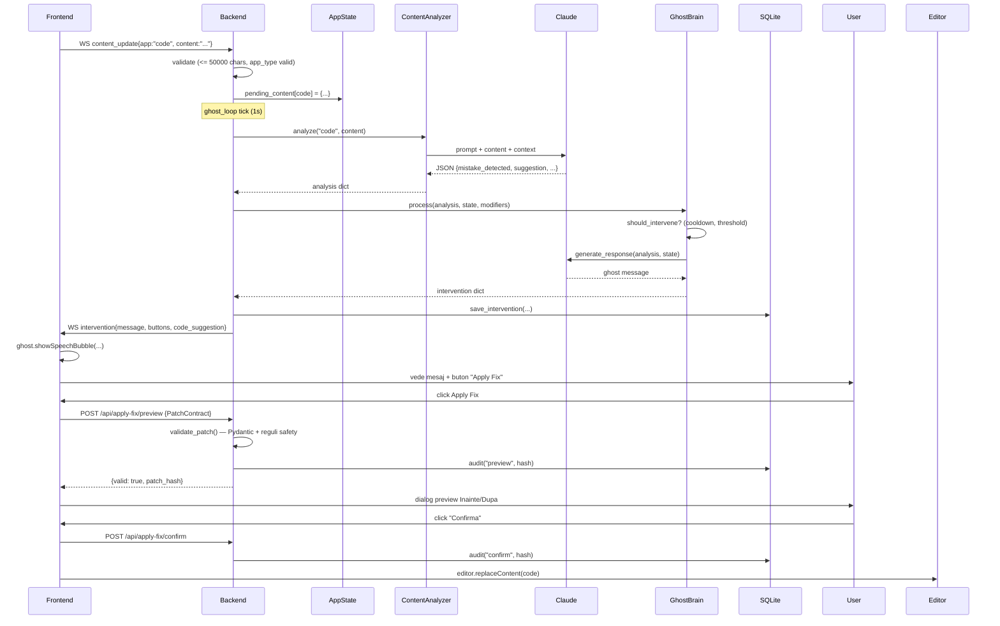
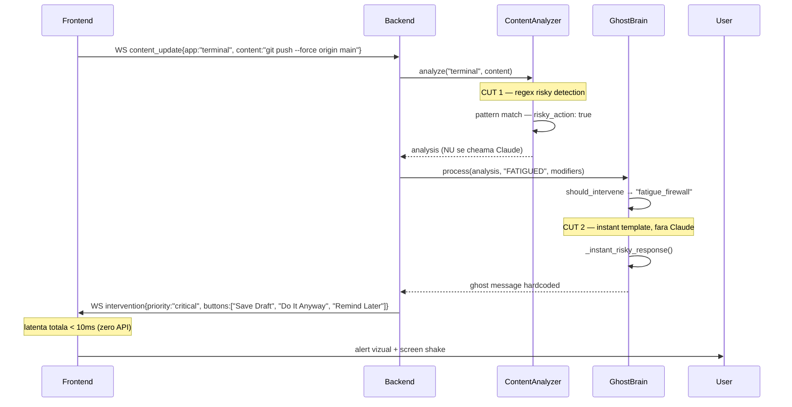
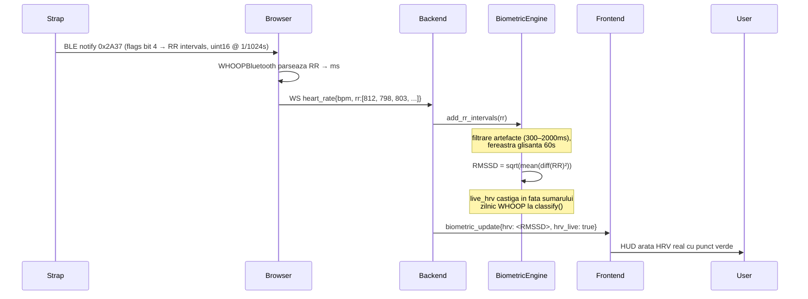
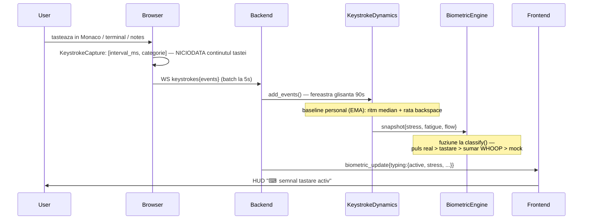

# arhitectura — DevLife

documentul central pentru criteriul II.1 (Proiectarea arhitecturala, 20 puncte). Toate diagramele si componentele sunt mapate la cod real din repo.

## privire de ansamblu

DevLife este o aplicatie client-server cu doua moduri operationale, conectate la doua surse externe (biometrice + AI) si la o persistenta locala.

```
┌─────────────────────────────────────────────────────────┐
│                    Browser (PixiJS)                      │
│  ┌────────────┐  ┌────────────┐  ┌──────────────────┐  │
│  │ Camera 2.5D│  │ HUD overlay│  │ Apps (5 surfaces)│  │
│  │ izometrica │  │ biometrica │  │ Code/Term/Browse │  │
│  └────────────┘  └────────────┘  └──────────────────┘  │
└────────────────────────────┬────────────────────────────┘
                             │ ws:// + REST
┌────────────────────────────▼────────────────────────────┐
│              FastAPI Backend (Python)                    │
│  ┌──────────────┐  ┌─────────────────┐  ┌────────────┐ │
│  │ AppState     │  │ biometric_loop  │  │ ghost_loop │ │
│  │ (centralizat)│  │ (5s polling)    │  │ (1s tick)  │ │
│  └──────────────┘  └─────────────────┘  └────────────┘ │
│  ┌──────────────┐  ┌─────────────────┐  ┌────────────┐ │
│  │ Pydantic     │  │ slowapi rate    │  │ logging    │ │
│  │ validation   │  │ limit 30/min    │  │ structurat │ │
│  └──────────────┘  └─────────────────┘  └────────────┘ │
└──────┬───────────────────┬──────────────────┬───────────┘
       │                   │                  │
       ▼                   ▼                  ▼
┌──────────────┐  ┌──────────────────┐  ┌─────────────┐
│ SQLite WAL   │  │  Claude API      │  │ WHOOP API   │
│ persistenta  │  │  (Anthropic)     │  │ + Chrome BLE│
└──────────────┘  └──────────────────┘  └─────────────┘
```

## layer-uri si responsabilitati

### Layer 1 — Frontend (PixiJS, vanilla JS)

Locatie: `frontend/src/`

**Render izometric procedural** (fara sprite sheets pentru core):
- `room/Room.js` — camera principala 2.5D
- `room/Furniture.js` — tot mobilierul e desenat procedural cu PIXI.Graphics (zero sprite-uri externe)
- `room/Atmosphere.js` — vignette, ambient glow, screen shake
- `room/Plant.js` — plant procedural care creste cu activitatea utilizatorului
- `character/Player.js`, `character/Ghost.js` — protagonistii

**HUD si overlay-uri**:
- `hud/HUD.js` — biometrice live (HR, HRV, recovery, strain, CQI)
- `hud/DashboardOverlay.js` — dashboard extins (ECG procedural, autonomic balance)
- `hud/DemoHotbar.js` — switcher 1-5 pentru stari mock
- `hud/ToastSystem.js` — notificari non-intrusive (cu butoane de actiune, ex. Revert)
- `hud/ShortcutsOverlay.js` — panoul de scurtaturi de tastatura (`?`)
- `hud/TransitionOverlay.js` — tranzitii intre scene

**Aplicatii in-game** (5 surfaces):
- `apps/CodeEditor.js` (Monaco) — editor de cod cu detectie bug-uri + Apply Fix
- `apps/Terminal.js` — emulator terminal cu detectie risky commands
- `apps/Browser.js` — browser in-app cu detectie rabbit hole
- `apps/Notes.js` — notite cu analiza tonului
- `apps/Chat.js` — conversatie cu Ghost

**Scene exterioare** (Town):
- `town/Town.js` + `town/TownPlayer.js` + `town/TownGhost.js` — lumea hub
- `town/CafeScene.js` — cafenea cu sistem brewing
- `town/CoworkScene.js` — spatiu coworking cu NPCs animate
- `town/TownDialogue.js` — sistem dialog NPC
- `scenes/SceneManager.js` — gestiune tranzitii

**Network**:
- `network/WebSocket.js` — `GhostSocket` cu backoff exponential pentru reconectare
- `network/WHOOPBluetooth.js` — Web Bluetooth API pentru BPM live (Heart Rate Service standard BLE)

**Sistem audio**:
- `audio/SoundManager.js` — sunete sintetizate procedural prin Web Audio API (zero fisiere externe)

**Cinematice**:
- `demo/DemoMode.js` — secventa demo cu capitole numerotate
- `menu/MainMenu.js` + `menu/SettingsMenu.js`

**Internationalizare**:
- `i18n/index.js` + `ro.json` + `en.json` — toggle RO/EN cu fallback ro, persistat in localStorage

### Layer 2 — Comunicare (WebSocket + REST)

WebSocket bidirectional pentru latenta mica:

**Server → client**:
- `biometric_update` — date biometrice + stare clasificata (la fiecare 5s)
- `state_change` — tranzitie de stare cu motiv
- `intervention` — interventie Ghost cu mesaj + butoane
- `plant_update` — delta crestere plant
- `sleep_mode` — activare/dezactivare cand BLE deconectat sau HR < 50
- `degraded_mode` — banner cand WHOOP API este indisponibil
- `app_focus_change` — broadcast al schimbarii aplicatiei active

**Client → server**:
- `mock_state` — schimbare manuala stare (hotbar 1-5)
- `content_update` — text curent din app activa (debounced 1.5s)
- `feedback` — raspuns utilizator la interventie
- `app_focus` — aplicatie activa schimbata
- `heart_rate` — BPM live din BLE

REST endpoints (vezi `server.py`):
- `GET /health` — alive check
- `GET /ready` — readiness (returneaza 503 daca lipsesc dependinte critice)
- `GET /api/status` — status agregat
- `POST /api/biometric/mock` — set stare (rate limit 30/min)
- `POST /api/feedback` — feedback la interventie
- `GET /api/history` — interventii istoric (cu `since` + `limit`)
- `GET /api/game/apps` — lista aplicatii in-game
- `POST /api/apply-fix/preview` — valideaza patch + returneaza hash
- `POST /api/apply-fix/confirm` — confirma aplicarea
- `POST /api/apply-fix/rollback` — restaureaza original
- `GET /api/whoop/auth` — initiaza OAuth flow
- `GET /api/whoop/callback` — primeste codul OAuth si schimba pe token

### Layer 3 — FastAPI Backend (Python)

Locatie: root `*.py` + `apply_fix/` + `persistence/`

**Core orchestration** — impartit in 4 module cu responsabilitati clare:
- `runtime.py` — `AppState` dataclass (toate variabilele globale incapsulate), singletons
  (engine/brain/analyzer), `broadcast_sync()` — marshaling broadcast-uri din thread-uri
  non-async catre event loop cu `asyncio.run_coroutine_threadsafe` — si `build_biometric_msg`
- `loops.py` — cele 2 thread-uri daemon:
  - `biometric_loop` (5s) — fetch WHOOP / mock / BLE, clasifica, persista sample replay, broadcast
  - `ghost_loop` (1s) — citeste pending_content, ruleaza ContentAnalyzer + GhostBrain, broadcast interventii
- `ws_game.py` — handler-ele mesajelor WS de joc, dispatch prin `WS_HANDLERS` (un mesaj nou =
  o functie + o intrare in dict); validare payload cu bounds explicite
  (`WS_MAX_CONTENT_CHARS=50000`, `WS_MAX_ACTION_CHARS=100`, etc.)
- `server.py` — app-ul FastAPI, `lifespan(app)` (connect DB, start session, lansare thread-uri),
  rutele HTTP si endpoint-urile WebSocket (joc + cele privilegiate locale)

**Biometric engine** (`biometric_engine.py`):
- OAuth 2.0 client pentru WHOOP API (auth, exchange, refresh, _save_tokens, _load_tokens)
- `fetch_data()` — pull recovery + strain + sleep + HRV
- `classify(data)` — algoritm Yerkes-Dodson cu reguli explicite (vezi mai jos)
- `get_personality_modifiers(state)` — parametri per stare (verbosity, threshold, capture_interval, max_tokens)
- `live_heart_rate` injectat din BLE — prioritate fata de WHOOP "lent"

**Ghost brain** (`ghost_brain.py`):
- `should_intervene(analysis, state, modifiers)` — engine de decizie cu cooldown adaptiv
- `generate_response()` — apel Claude API cu system prompt per stare (DEEP_FOCUS, STRESSED, FATIGUED, RELAXED, WIRED)
- `_instant_risky_response()` — template hardcoded pentru fatigue firewall (zero latenta, fara API call)
- `process()` — orchestreaza decizia + raspunsul + alegerea butoanelor UI
- `user_feedback()` — track accept/ignore pentru adaptarea cooldown-ului

**Content analyzer** (`content_analyzer.py`):
- 5 prompts dedicate per app type (`APP_PROMPTS`)
- `RISKY_COMMAND_PATTERNS` — 11 regex compiled pentru detectie instant (latenta < 1ms)
- `analyze(app_type, content, ...)` — CUT 1: early exit pentru risky commands; altfel apel Claude cu prompt routed
- Tracking "stuck" — content hash repetat → semnal Claude ca utilizatorul nu progreseaza

**Vision analyzer** (`vision_analyzer.py`) — folosit doar in `GAME_MODE=False`:
- Trimite screenshot-uri (deduplicate cu ImageHash) catre Claude Vision
- Mai costisitor in token-uri, dar functioneaza cu IDE-ul real

**Mock biometrics** (`mock_biometrics.py`):
- 5 presets (cate unul per stare cognitiva) cu valori realiste
- Tranzitie smooth intre presets (20 pasi peste 2s)
- Modul "seeded" pentru DEMO_OFFLINE — reproducibil

**Context tracker** (`context_history.py`):
- Pastreaza istoricul ultimelor 20 de analize Claude
- Genereaza summary pentru injectare in prompt-ul urmator

**Fallback responses** (`fallback_responses.py`):
- Mesaje hardcoded per stare, folosite cand Claude API esueaza sau e prea lent

### Layer 4 — Apply Fix module

Locatie: `apply_fix/`

Separare clara intre contract (input shape), validator (reguli safety) si audit (logging persistent):
- `contract.py` — `PatchContract` Pydantic: file, language, range, replacement_text, rationale, severity, original_text
- `validator.py` — reguli: rationale non-vid, end_line >= start_line, range <= 50 linii, replacement <= 50 linii, fara shell metacharacters
- `audit.py` — wrapper peste `persistence.db.save_apply_fix_audit()`

Lifecycle complet:
1. Frontend trimite `PatchContract` → `POST /api/apply-fix/preview`
2. Backend: Pydantic validates → `validate_patch()` ruleaza regulile → daca OK, returneaza `patch_hash` + stocheaza `original_text` in `pending_patches`; daca NU OK, scrie audit "reject" cu motivul
3. Frontend afiseaza preview side-by-side
4. La click "Confirm": `POST /api/apply-fix/confirm` cu `patch_hash` → audit "confirm"
5. La click "Cancel": frontend doar inchide dialog-ul, backend nu este implicat
6. La click "Revert" dupa aplicare: `POST /api/apply-fix/rollback` → audit "rollback" + returneaza `original_text`

### Layer 5 — Persistence (SQLite + WAL)

Locatie: `persistence/`

`db.py` — functii pure pentru DB:
- `connect()` — singleton conexiune cu PRAGMA `journal_mode=WAL` (concurency read non-blocking)
- `_run_migrations()` — idempotent, ruleaza `migrations/*.sql` in ordine
- `start_session()`, `end_session()`, `current_session_id()` — ciclu de viata sesiune
- `save_intervention()`, `save_biometric()`, `save_feedback()`, `save_apply_fix_audit()` — inserts cu `?` parameter binding (anti SQL injection)
- `get_interventions(since, limit)` — query istoric cu JOIN sesiuni

Schema (migrations/001_init.sql) — 6 tabele:
- `sessions` — rulari aplicatie (id, started_at, ended_at, mode, whoop_connected)
- `interventions` — fiecare interventie Ghost (id, session_id, ts, state, source, content_hash, claude_text, fallback_used)
- `biometric_samples` — date raw (id, session_id, ts, hr, hrv, recovery, strain, source)
- `feedback` — raspunsuri utilizator (id, intervention_id, ts, rating, comment)
- `apply_fix_audit` — lifecycle complet patch-uri (id, session_id, ts, file, range_before, patch_hash, action, reason)
- `consent` — scope-uri OAuth aprobate (id, ts, granted_scopes_json)

## algoritm de clasificare (cod real)

Din `biometric_engine.py::classify()`:

```python
if recovery < 40 or sleep < 0.7:
    state = "FATIGUED"
elif estimated_stress >= 2.0 or strain > 16:
    state = "STRESSED"
elif strain > 12 and recovery < 60:
    state = "WIRED"
elif 0.9 <= estimated_stress <= 1.5 and 8 <= strain <= 14 and recovery > 60:
    state = "DEEP_FOCUS"
else:
    state = "RELAXED"
```

unde `estimated_stress` este derivat din raportul HRV/baseline:
- ratio < 0.6 → stress 2.5
- ratio < 0.75 → stress 1.8
- ratio < 0.85 → stress 1.2
- altfel → stress 0.5

Live heart rate (BLE) are prioritate fata de WHOOP "lent" (refresh ~5 min). Cand BLE este conectat si transmite, `bio.current_state` recalibreaza din BPM in timp real.

## flow tipic — request lifecycle

### scenariu: utilizator scrie cod cu bug



### scenariu: utilizator FATIGUED scrie `git push --force`



### scenariu: HRV live din intervalele RR (BLE → RMSSD → clasificare)



De ce conteaza: WHOOP expune HRV o data pe zi (sumarul de dimineata). Din intervalele RR
brute transmise pe BLE, DevLife calculeaza acelasi tip de metrica (RMSSD — standardul pentru
HRV pe fereastra scurta) **in timp real**, deci `estimated_stress` si Fatigue Firewall
reactioneaza la starea autonoma din momentul respectiv, nu la cea de ieri. Matematica e in
`biometric_engine.py::compute_live_hrv`, cu teste pe valori calculate de mana (`test_live_hrv.py`).

### scenariu: dinamica tastarii ca semnal biometric (zero hardware)



Fundament: literatura de keystroke dynamics — stresul apare ca tastare mai rapida si cu mai
multe corecturi fata de propriul baseline (Epp 2011), oboseala ca ritm mai lent, erratic, cu
pauze lungi (Vizer 2009). Totul e relativ la baseline-ul personal invatat (EMA lent), nu la
praguri absolute. Reguli de fuziune in `classify()`: un puls real pe BLE nu e niciodata
depasit de tastare (doar rafineaza stresul estimat); fara puls si fara WHOOP, tastarea devine
singurul semnal real si **depaseste generatorul mock**; in modurile demo (`demo_locked`)
tastarea prezentatorului nu poate fura starea scriptata. Confidentialitate: frontend-ul trimite
doar intervale si categorii (char/backspace/enter/nav) — continutul tastelor nu paraseste
niciodata browserul. Cod: `keystroke_dynamics.py`, teste pe valori calculate de mana in
`test_keystroke_dynamics.py` (11 teste).

**Calibrare persistenta:** baseline-urile personale (ritmul de tastare, rata de backspace,
HR-ul de repaus, HRV-ul de referinta) se salveaza in SQLite (tabelul `calibration`, migratia
003) — la fiecare ~60s din `biometric_loop` si la shutdown — si se incarca la pornire. Deci
sistemul nu reinvata de la zero (sau de la valori hardcodate) la fiecare rulare: din a doua
sesiune, deviatiile se masoara fata de ritmul TAU real. HRV-ul de referinta invata cate putin
(EMA 0.1) doar cand soseste un sumar WHOOP de dimineata NOU, nu la fiecare ciclu de 5s —
altfel baseline-ul ar converge la valoarea zilei si raportul ar fi mereu ~1. Cod:
`persistence/db.py::get/set_calibration`, `runtime.py::load/save_calibration`, teste in
`test_calibration.py`.

### scenariu: firewall server-side in PTY (defense in depth)

Interceptarea din UI (`Terminal.js`) poate fi ocolita de un client care vorbeste direct cu
WebSocket-ul de terminal. De aceea exista un al doilea strat, pe server:

```
tastele utilizatorului ──WS──> KeystrokeFirewall (terminal_pty.py)
                                  │  mirroreaza linia curenta (backspace, Ctrl-C/U, reset pe ESC)
                                  │  pe Enter: detect_risky_commands(linie) + stare FATIGUED/STRESSED?
                                  ├── sigur → byte-urile trec nemodificate spre PTY
                                  └── riscant → Enter-ul e INGHITIT, se scrie Ctrl-U (kill-line)
                                       → shell-ul nu primeste niciodata comanda
                                       → banner rosu in terminal + audit in SQLite
```

Cele doua straturi sunt tinute sincron printr-un test anti-drift (`test_firewall_sync.py`)
care parseaza pattern-urile din `Terminal.js` si le compara cu `content_analyzer.py`.
Limitare documentata: comenzile rechemate din istoricul shell-ului (sageata sus) sosesc ca
secvente escape, nu ca taste — mirror-ul se reseteaza pe ESC ca sa evite match-uri false.

### subsistem: session replay ("cutia neagra")

`biometric_loop` persista un sample la fiecare ciclu (HR, HRV — cel live daca exista,
recovery, strain, sursa, stare) in `biometric_samples`; interventiile erau deja persistate.
`GET /api/session/replay` intoarce ambele serii pe un timeline comun, iar dashboard-ul le
deseneaza: polilinia HR colorata dupa starea cognitiva, tick-uri rosii pentru interventii,
scrub cu mouse-ul pentru valori punctuale. Rezultatul: demo-ul nu mai e o simulare, e o
**dovada pe date reale** ("aici am obosit, aici ghost-ul m-a oprit din force push").

### subsistem: raport de sesiune exportabil

`db.get_session_report()` agrega o sesiune (distributia starilor din sample-uri — fiecare
sample ≈ un ciclu de 5s, deci numaratoarea pe stare ≈ timp petrecut; min/max/mediu pe puls
si HRV; lista interventiilor), iar `session_report.py::build_report_html` o randeaza intr-un
singur fisier HTML **self-contained** (CSS si SVG inline, zero dependinte externe) care se
deschide offline si se poate trimite pe mail. Timeline-ul SVG coloreaza segmentele de puls
dupa starea cognitiva si marcheaza interventiile cu tick-uri. Culorile sunt o copie
server-side a `frontend/src/theme.js`, tinuta sincron printr-un test anti-drift care
parseaza theme.js (`test_session_report.py`). Endpoints: `GET /api/session/report` (JSON,
pentru UI) si `GET /api/session/report/html?lang=ro|en` (documentul exportabil).

### subsistem: extensia VS Code (DevLife Bridge)

`vscode-extension/` vorbeste exact acelasi protocol WebSocket ca jocul — nicio linie de
backend in plus. `onDidChangeTextDocument` trimite snapshot-uri `content_update` (debounce
1.5s) cu codul REAL din editor, iar schimbarile de text se transforma in aceleasi perechi
(interval, categorie) pentru `keystroke_dynamics.py`. Interventiile ghost-ului sosesc ca
notificari VS Code cu butoanele originale (feedback-ul se intoarce in bucla de invatare),
iar starea cognitiva + pulsul stau in status bar. Handshake-ul WS fara header Origin e
permis explicit (`security.py::check_origin` — clientii non-browser se bazeaza pe token
pentru endpoint-urile privilegiate; extensia foloseste doar endpoint-ul de joc, neprivilegiat).
Asta muta DevLife din "joc cu editor" in "utilitar care functioneaza in editorul tau real".

## decizii arhitecturale cheie

| decizie | alternativa | motiv ales |
|---------|-------------|------------|
| Vanilla JS + PixiJS | React + Three.js | control complet pe render izometric procedural, fara overhead React lifecycle, ~50KB minified |
| FastAPI | Flask, Django, Express | Pydantic + WebSocket native + async/await + auto-validation 422 |
| SQLite | PostgreSQL | zero deployment overhead, WAL pentru concurency, portabil (~500 inserts/h) |
| 2 thread-uri daemon | full async | biometric polling + ghost decision sunt CPU-bound in burst-uri, thread-uri evita event loop blocking |
| AppState dataclass | global variables | testabilitate (fixture), encapsulare, type hints |
| Patch validator separat de orchestrare | inline checks | separation of concerns, testabil unitar, reutilizabil |
| Apply Fix audit in DB | log files | query-abil, durabil dupa restart, vizibil in admin tools |
| Claude API cu timeout 15s | timeout default (>10 min) | previne blocarea ghost_loop daca API atarna |
| WS bounds explicite | Pydantic global | WS nu suporta Pydantic decoder; bounds inline sunt mai rapide |

## paradigme de programare

- **Functional** (`persistence/db.py`, `apply_fix/validator.py`): functii pure cu input/output explicit, fara state, usor de testat.
- **Obiectual** (`BiometricEngine`, `GhostBrain`, `ContentAnalyzer`, `ScreenCapture`): incapsulare state (history, baseline, tokens), policies (cooldowns), methods cu side-effects controlate.
- **Dataflow** (`AppState`, WebSocket message types): mesaje tipizate care curg unidirectional intre layer-uri.
- **Event-driven** (`on_state_change_callback`, WS messages): reactivitate fara polling.

## extensibilitate

Aplicatia este proiectata pentru extindere usoara:

- **Adaugare app type nou**: editeaza `APP_PROMPTS` in `content_analyzer.py` + `GAME_APPS` in `config.py` + creaza fisier nou in `frontend/src/apps/` urmand pattern-ul existent.
- **Adaugare stare cognitiva noua**: extinde `_SIM_HR_RANGES`, `bio.classify()`, `GhostBrain.PROMPTS`, `fallback_responses.FALLBACKS`.
- **Adaugare risky pattern**: o singura linie in `RISKY_COMMAND_PATTERNS`.
- **Adaugare camp biometric**: extinde `MockBiometrics.PRESETS`, `BiometricEngine.fetch_data()`, `build_biometric_msg()`.
- **Adaugare scena noua**: implementeaza interfata `Scene` (enter, exit, update) si inregistreaza in `SceneManager`.

Toate aceste extinderi nu modifica codul existent — doar adauga.
